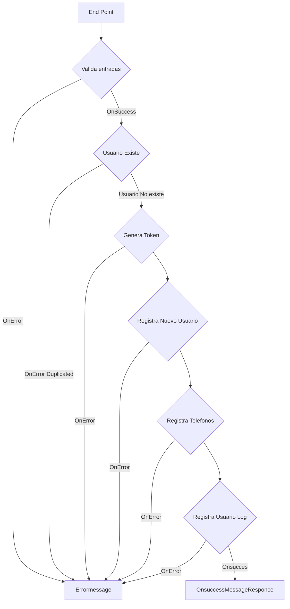
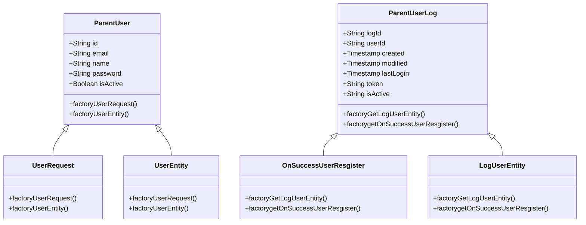

# Nisum Cchallenge
## Evaluación: JAVA

    Desarrolle una aplicación que exponga una API RESTful de creación de usuarios.
    Todos los endpoints deben aceptar y retornar solamente JSON, inclusive al para los mensajes de error.

    Todos los mensajes deben seguir el formato:

	`{"mensaje": "mensaje de error"}`
	
	

#### Tecnologias:

- java 17
- Spring boot 3.2.0
- h2
- Jpa Hibernate
- jwt: io.jsonwebtoken
- Log4j 2
- Validator
- OpenAI 3.0, swagger

#### Base de datos

### Flujo de la aplicacion

  El EndPoint expuesto con metodo Post recibe en su payload un usuraio. Si este usuario cumple con las validaciones del Payload, encripta el password
  Y Este RequestPayload pasa a clases de servicios

  Se verifica si el mail existe, si ya existe se lansa excepcion, en caso contrario, Registra el nuevo usuario.
 
  
  Inserta en una tabla de log el insert del nuevo usuarios.

#### Patrones de diseño

Patron Factory:

como clase padre para los objentos DTO json utilizados por la API y dto entidades de la base de datos. Entoces por ejemplo:

se recive en el payloads un objeto json, este objeto json es persistido en la base de datos y en caso de exito se responce un objeto json son datos del objeto insertados.

para este trabajo se tienen las clases ParentUser, UserRequest y UserEntity

Para el log del ususario y la respuesta al cliente:
ParentUserLog, OnSuccessUserResgister, LogUserEntity

##### Diagrama de clases:

#### Validaciones y mensajes.

Las validaciones y mensajes de los DTO json y entidades de base dedatos fueron extrenalizadas a los archivos:

- validator-messages.properties
- patterns.properties
- error-messages.properties

#### GitFlow

Se utilizo Gitfloy y se crearon las ramas:

- master
- develop
- release
- feature:
		- /configTecnologies
		- /registerUser
