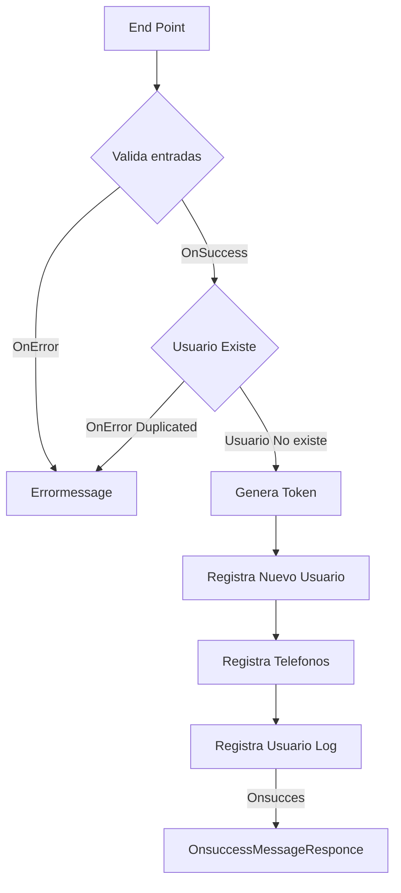

# Nisum Cchallenge
## Evaluación: JAVA

    Desarrolle una aplicación que exponga una API RESTful de creación de usuarios.
    Todos los endpoints deben aceptar y retornar solamente JSON, inclusive al para los mensajes de error.

    Todos los mensajes deben seguir el formato:

`{"mensaje": "mensaje de error"}`

#### Tecnologias:

- java 17
- Spring boot 3.2.0
- h2
- Jpa Hibernate
- jwt: io.jsonwebtoken
- Log4j 2
- Validator

### Flujo de la aplicacion

#### Patrones de diseño

Patron Factory:

como clase padre para los ogjentos DTO json utilizados por la API y dto entidades de la base de datos. Entoces por ejemplo:

se recive en el payloads un objeto json, este objeto json es persistido en la base de datos y en caso de exito se responce un objeto json son datos del objeto insertados.

